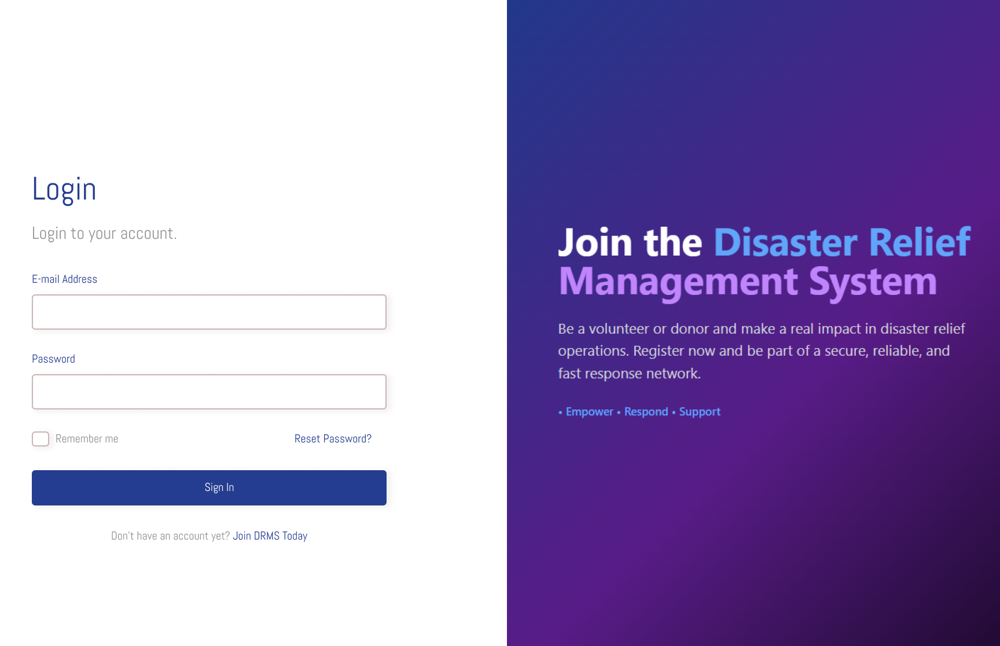

# 🎨 Disaster Relief Management System — Figma Design Prototype

A **comprehensive UI/UX design** for the **Disaster Relief Management System**, including **Web** and **Mobile** versions.  
Designed to manage disaster relief operations, coordinate volunteers, track requests and resources, and handle donations with **ease and clarity**.

---

## 🌐 Live Figma Prototypes

<table align="center">
<tr>
<td align="center" width="50%">
<a href="https://www.figma.com/design/7mJrgVIo5jIipgDL3LB8ni/DRMS-Website-Version?node-id=0-1&t=nMRb15HxTHxtRh6L-1">

<br><br>
<b>💻 Web Version</b>
<br>
<i>Desktop & Tablet</i>
</a>
</td>
<td align="center" width="50%">
<a href="https://www.figma.com/design/NAIaoQ60tByhlE9iSts1mp/DRMS-Mobile-Version?node-id=2-20347&t=w61R9rSwU8gQJMvO-1">

<br><br>
<b>📱 Mobile Version</b>
<br>
<i>Touch-Optimized</i>
</a>
</td>
</tr>
</table>

<p align="center"><i>👆 Click the images above to explore the interactive prototypes on Figma.</i></p>

---

## 🗂️ Repository Structure

```
Disaster_Relief_Management_System_Design/
├── design/
│   ├── web-preview.png                 # Web version preview
│   ├── mobile-preview.png              # Mobile version preview
│   ├── disaster-relief-web.fig         # Web Figma source file (optional)
│   └── disaster-relief-mobile.fig      # Mobile Figma source file (optional)
└── README.md
```

---

## 📋 Key Features

This prototype demonstrates:

- 🔐 **Role-based interfaces**: Separate dashboards for Admin, Volunteer, and Donor roles
- 🌍 **Real-time dashboards**: Live monitoring of disaster zones and relief operations
- 📦 **Resource & donation tracking**: Comprehensive inventory and contribution management
- 🤝 **Request handling**: Efficient system for managing and prioritizing relief requests
- 👥 **Volunteer coordination**: Task assignment and communication tools
- 🖥️ **Web version**: Optimized for desktop & larger screens
- 📱 **Mobile version**: Touch-friendly UI for smartphones
- 🧭 **Responsive layouts**: Adapts seamlessly across multiple devices

---

## 🎨 Design Highlights

### Visual Design
- 🎨 Consistent **color palette** & typography across all screens
- 🧭 Intuitive **navigation and workflow** optimized for each user role
- 🖼️ Clean, modern, and **accessible UI** following best practices

### Interaction Design
- 📲 Interactive **prototype screens** simulating real user actions
- 📐 Fully **responsive design** for Web & Mobile platforms
- ⚡ Smooth transitions and micro-interactions for enhanced UX

### Component System
- 🧩 Reusable component library for consistency
- 📊 Data visualization elements (charts, graphs, maps)
- 🎯 Clear status indicators and feedback mechanisms

---

## 🚀 How to Use

### View Prototypes
1. Click on the preview images above to open the live Figma prototypes
2. Navigate through screens by clicking interactive elements
3. Explore different user flows for Admin, Volunteer, and Donor roles

### Edit Design Files
1. Download the `.fig` files from the `design/` folder
2. Open Figma → **File → Import**
3. Select the downloaded `.fig` file to start editing
4. *Alternative*: Duplicate the live prototype directly from Figma

### Export Assets
- Use Figma's export feature (**File → Export**) for icons and components
- All design assets follow **consistent design guidelines**

---

## 🎯 User Roles & Flows

### 👨‍💼 Admin Dashboard
- Monitor active disaster zones and resource allocation
- Manage volunteers and approve registrations
- Generate reports and analytics

### 🤝 Volunteer Portal
- Browse and accept available tasks
- Track hours and completed activities
- Navigate to relief distribution points

### 💝 Donor Interface
- Make secure donations to active campaigns
- Track donation impact and utilization
- Receive updates on relief efforts

---

## 📐 Design Specifications

### Color Palette
- **Primary**: Emergency Red (`#E63946`)
- **Secondary**: Trust Blue (`#457B9D`)
- **Success**: Relief Green (`#2A9D8F`)
- **Warning**: Alert Orange (`#F4A261`)

### Typography
- **Headings**: Inter Bold
- **Body Text**: Inter Regular
- **UI Elements**: Inter Medium

### Screen Sizes
- **Mobile**: 375px - 767px
- **Tablet**: 768px - 1024px
- **Desktop**: 1025px+

---

## 🧠 Notes

- `.fig` files can be imported into Figma (**File → Import**) for editing
- Live prototype links allow full exploration of **screen transitions and interactions**
- All assets follow **consistent design guidelines** for icons, colors, and typography
- Designed with **accessibility** in mind (WCAG 2.1 AA compliance)
- Prototypes include sample data for realistic demonstration

---

## 🔜 Future Enhancements

- [ ] Dark mode design variant
- [ ] Multi-language support
- [ ] Offline functionality design
- [ ] Advanced map features with heat maps
- [ ] Real-time notification system

---

## 📜 License

This design is part of the **Disaster Relief Management System** project.  
You may **view, reference, and modify** it, but please provide **attribution**.

---

## 👤 Contact

**🖋️ Author:** [Your Name]  
**📧 Email:** your.email@example.com  
**💼 LinkedIn:** [Your Profile]  
**📅 Created:** October 2025

---

<div align="center">

**⭐ If you find this design useful, please star this repository!**

[](https://www.figma.com)
[](LICENSE)

</div>
